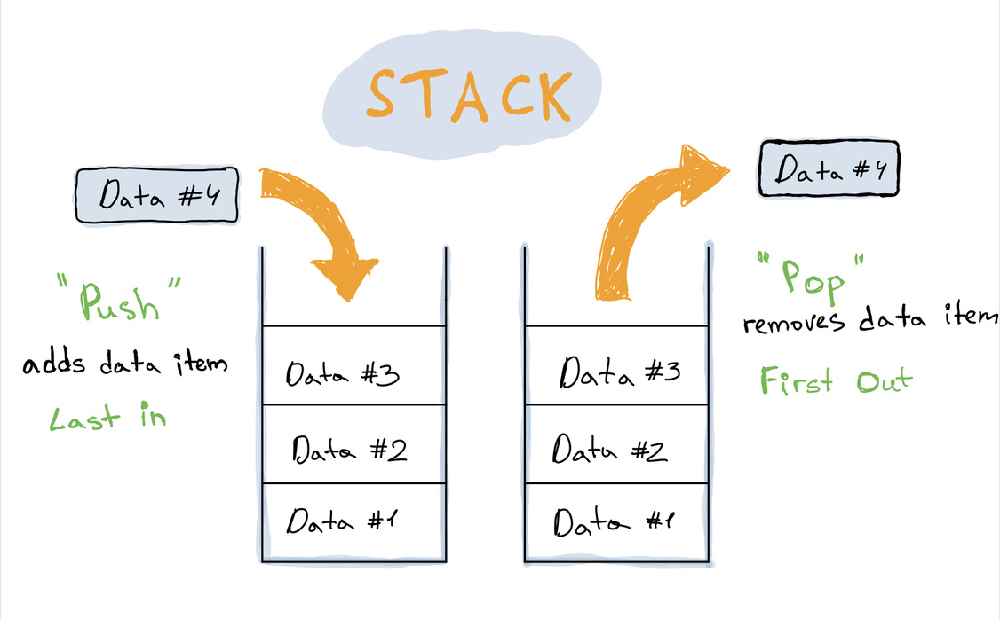

# Stack

## Description



A Stack is a linear data structure where elements are stacked on each other. It's like an array, but with a few restrictions:

* You can't access items randomly by using their index.
* You can only add an item to the end, and remove or retrieve the lastest item.

This simplest way to think about stack structure is to imaging a deck of cards or a stack of plates. You put a plate on top of another, and to access a plate in the middle you first need to get plates from the top.

A stack uses **LIFO** \(_last-in-first-out_\) ordering which means that the last pushed item to the stack is processed first \(all previous items will need to wait until newer are processed\)  

### Base Operations

| Method | Description |
| :--- | :--- |
| **push\(\)** | Add item to a stack. |
| **pop\(\)** | Remove item from a stack. |
| _**peek\(\)**_ | Get the latest item in a stack. |

### When to use

* Checking an opening/closing structure. For example, a task to detect balanced usage of opening and closing parentheses, brackets, and quotes. `[]()""([])`
* Undoing \(backtracking from\) an action.
* Reversing data.
* and more...

### Time Complexity

| Operation | Complexity |
| :--- | :--- |
| Insertion | O\(1\) |
| Deletion | O\(1\) |
| \*Access | O\(n\) |

_\*To access some value you need first to pop an element from the top._

## Code

* The first tab is the implementation of Stack using JS Arrays.
* The second tab is the implementation of Stack using Linked List.






```typescript
interface IStack<T> {
  push(item: T): void;
  pop(): T | undefined;
  peek(): T | undefined;
  getSize(): number;
  toArray(): T[];
  toString(): string;
}

export class Stack<T> implements IStack<T> {
  private storage: T[] = [];
  
  /** Push item to stack */
  public push(element: T): void {
    this.storage.push(element);
  }
  
  /** Remove item from stack */
  public pop(): T | undefined {
    return this.storage.pop();
  }
  
  /** Get the latest item in stack */
  public peek(): T | undefined {
    return this.storage[this.getSize() - 1];
  }

  public getSize(): number {
    return this.storage.length;
  }

  public toArray(): T[] {
    return this.storage;
  }

  public toString(): string {
    return this.storage.toString();
  }
}

export default Stack;

```





```typescript
import { DoublyLinkedList } from "./DoublyLinkedList";

interface IStack<T> {
  push(item: T): void;
  pop(): T | null;
  peek(): T | null;
  getSize(): number;
  toArray(): T[];
  toString(): string;
}

export class Stack<T> implements IStack<T> {
  private storage = new DoublyLinkedList<T>();
  
  /** Add item to stack */
  public push(item: T) {
    this.storage.prepend(item);
  }
  
  /** Remove item from stack */
  public pop(): T | null {
    return this.storage.deleteHead()?.value;
  }
  
  /** Get the latest item in stack */
  public peek(): T | null {
    return this.storage.getFirst()?.value;
  }

  public toArray(): T[] {
    return this.storage.toArray().map((node) => node.value);
  }

  public toString(): string {
    return this.storage.toString();
  }

  public getSize(): number {
    return this.storage.getSize();
  }
}
```





```typescript
interface INode<T> {
  value: T;
  next: Node<T> | null;
  previous: Node<T> | null;
}

class Node<T> implements INode<T> {
  /**
   * @param value of the Node
   * @param next - reference to the next Node
   * @param previous - reference to the previous Node
   */
  constructor(
    public value: T,
    public next: Node<T> | null = null,
    public previous: Node<T> | null = null
  ) {}
}

interface ILinkedList<T> {
  prepend(value: T): void;
  append(value: T): void;
  getFirst(): Node<T> | null; // ✨ New method
  getLast(): Node<T> | null; // ✨ New method
  getSize(): number; // ✨ New method
  find(value: T): Node<T> | null;
  deleteHead(): Node<T> | null; // ✨ New method
  deleteTail(): Node<T> | null; // ✨ New method
  toArray(): Node<T>[];
  toString(): string;
}

export class DoublyLinkedList<T> implements ILinkedList<T> {
  protected head: Node<T> | null;
  protected tail: Node<T> | null;

  constructor() {
    this.head = null;
    this.tail = null;
  }

  /** Creates new node and inserts at the start of the list */
  public prepend(value: T): void {
    // Create new node with the next reference as the head
    const newNode = new Node(value, this.head);

    // Update our head to contain new element
    this.head = newNode;

    // If there is no tail update it too
    if (!this.tail) {
      this.tail = newNode;
    }
  }

  /** Creates new node and inserts in the end of the list */
  public append(value: T): void {
    const newNode = new Node(value);

    // If there is no head create it
    if (!this.head || !this.tail) {
      this.head = newNode;
      this.tail = newNode;
    }

    // Add new node to the tail
    this.tail.next = newNode;
    // Update new Node's previous reference
    newNode.previous = this.tail;
    // Set new node to be the tail of the list.
    this.tail = newNode;
  }

  /** Get first node */
  public getFirst(): Node<T> | null {
    return this.head;
  }

  /** Get last node */
  public getLast(): Node<T> | null {
    return this.tail;
  }

  /** Get size of linked list */
  public getSize(): number {
    let size = 0;

    if (!this.head) {
      return size;
    }

    let currentNode: Node<T> | null = this.head;

    while (currentNode) {
      currentNode = this.head.next;
      size++;
    }

    return size;
  }

  /** Get last element */

  /** Finds element inside the linked list */
  public find(value: T): Node<T> | null {
    if (!this.head) {
      return null;
    }

    let currentNode: Node<T> | null = this.head;
    while (currentNode) {
      if (currentNode.value === value) {
        return currentNode;
      }

      currentNode = currentNode.next;
    }

    return null;
  }

  /** Removes current head node */
  public deleteHead(): Node<T> | null {
    const deletedNode = this.head;

    if (this.head?.next) {
      this.head = this.head.next;
    } else {
      this.head = null;
      this.tail = null;
    }

    return deletedNode;
  }

  /** Removes current tail nodee */
  public deleteTail(): Node<T> | null {
    const deletedNode = this.tail;

    if (this.tail?.previous) {
      this.tail = this.tail.previous;
    } else {
      this.head = null;
      this.tail = null;
    }

    return deletedNode;
  }

  /** Converts linked list to array */
  public toArray(): Node<T>[] {
    const nodes = [];

    let currentNode = this.head;
    while (currentNode) {
      nodes.push(currentNode);
      currentNode = currentNode.next;
    }

    return nodes;
  }

  /** Converts linked link to string representation */
  public toString(): string {
    return this.toArray()
      .map((node) => node.value)
      .toString();
  }
}

```




