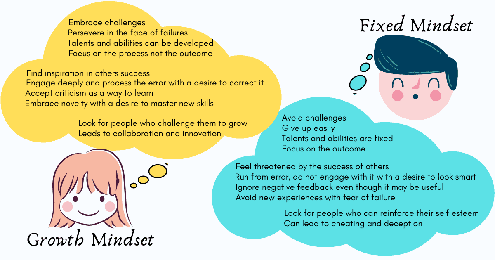

# Fixed vs Growth Mindset

Our mind plays a powerful role in how we deal with success and failure in professional and personal life. It's all about mindset.

Studies have shown that there are two kinds of mindsets we can navigate with - _**Growth**_ and _**Fixed**_. The difference between the two mindsets is how people face challenges and failures.

### ❌ Fixed Mindset as a developer

People with a fixed mindset assume that their abilities and understanding are relatively fixed, they are scared of a challenge. Perhaps they work only on the same projects, use the same technologies, and try to find a way to do the same work.

They are afraid of failure. Failure means to them that it's a limit of their abilities, and people can figure out who they really are. Fixed mindset developers want and try to only appear in situations where they feel smart.

Fixed mindset folk:

* Avoid challenging situations.
* Write code away from others in attempting to avoid receiving feedback.
* Unable to handle criticism or negative feedback because it's considered a personal attack.
* Give up easily.
* Don't put much effort. They think that their abilities are static, more effort is a waste of time.

### ✅ Growth mindset as a developer

Growth mindset folks understand that their abilities and understanding can be developed. Those with a growth mindset believe that they can get smarter and more talented by putting in time and effort.

People with a growth mindset don't avoid challenges as they are not afraid of failure. Failure is an opportunity to discover what they don't know. Failure is an indication that they should continue to sharpen their skill rather than thinking "I am not good at it". 

Growth mindset folk:

* Put themselves in challenging situations where they can grow.
* Involve others when they code.
* Treat negative feedback as a way to learn something.
* Don't give up easily.
* Believe that putting more effort is a way to solve a challenge.
* Great listeners. They want to hear others POV to learn something.

## 🧠 You need to have a growth mindset as a developer.

