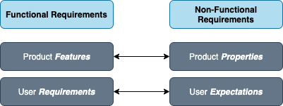

# Functional Requirements vs Non-functional requirements

Software or System requirements are often classified as functional and non-functional requirements

## What are Functional Requirements?

> Any Requirement Which Specifies _**What The System Should Do**_.

A Functional requirement will describe a particular behavior of function of the system when certain conditions are met, for example: “Send email when a new customer signs up” or “Open a new account”.

### Typical Functional Requirements Examples

* Business rules
* Authentication
* Authorization
* Authorization levels

### Examples

* Authentication of a user when he/she tries to log into the system.
* System shutdown in the case of a cyber-attack.
* A verification email is sent to a user whenever they register for the first time on some software system.

## What are non-Functional requirements?

> Any requirement that specifies **HOW** the system performs a certain function.

Simply put, the difference is that **non-functional requirements describe how the system works**, while **functional requirements describe what the system should do**.

In case non-Functional requirements are not met the basic functionality will not be impacted. However, non-functional requirements deal with system usability, and this important as well. Non-functional requirements affect the user experience.

> Non-functional requirements when defined and executed well will help to make the system easy to use and enhance the performance. Non-functional requirements focus on user **expectations**, as they are product properties.

### Typical non-Functional requirements

Non-Functional Requirements are also [quality attributes](https://en.wikipedia.org/wiki/List_of_system_quality_attributes), so they may include:

* _Usability_ - addresses the simple question "_How hard is it to use the product?"._
* _Securability_ - assures that all data inside the system or its part will be protected against attacks or unauthorized access.
* _Reliability_ - specifies how likely a system or its part would run without failures for a defined period of time. 
* _Availability_ - describes how likely the system is accessible to a user at a point in time. For example, the system may be available 98% of the time during a month.
* _Performance_ - defines how fast the system or its part responds to certain user actions under certain conditions/workload.

### Examples

* An email should be sent to a user with a maximum latency of 12 hours. -&gt; _Performance_
* Each request should be processed within 10 seconds. -&gt; _Performance_
* Use should not be able to save a password that contains only characters or only numbers. -&gt; _Security_

## Summary

ℹ️ Software or System requirements are classified as _**functional and non-functional requirements**_. Functional requirements define/specify what the system should do and they are mandatory. Non-functional requirements are system quality attributes, they describe how the system should behave and establish constraints of its functionality.

