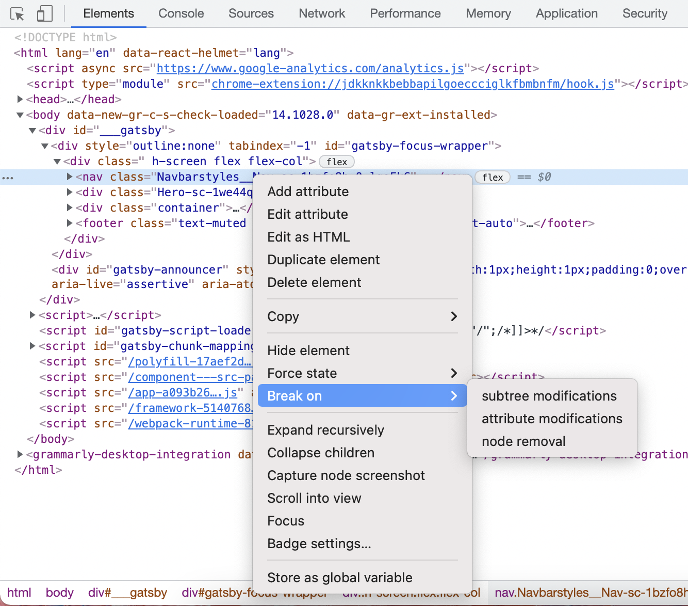

# DOM change breakpoints

Use a DOM change breakpoints when you want to pause on the code that changes a DOM node or its children. This might be useful if you don't know when or why your DOM element changes.

### **How to set DOM change breakpoints?**

1. In the **Elements** tab navigate to the element that you want to set the breakpoint on.
2. Right-click on this element.
3. Hover over **Break on** then select **Subtree modifications**, **Attribute modifications** or **Node removal**.

#### Read more:

* [Chrome Developers \| Pause your code with breakpoints](https://developer.chrome.com/docs/devtools/javascript/breakpoints/)

